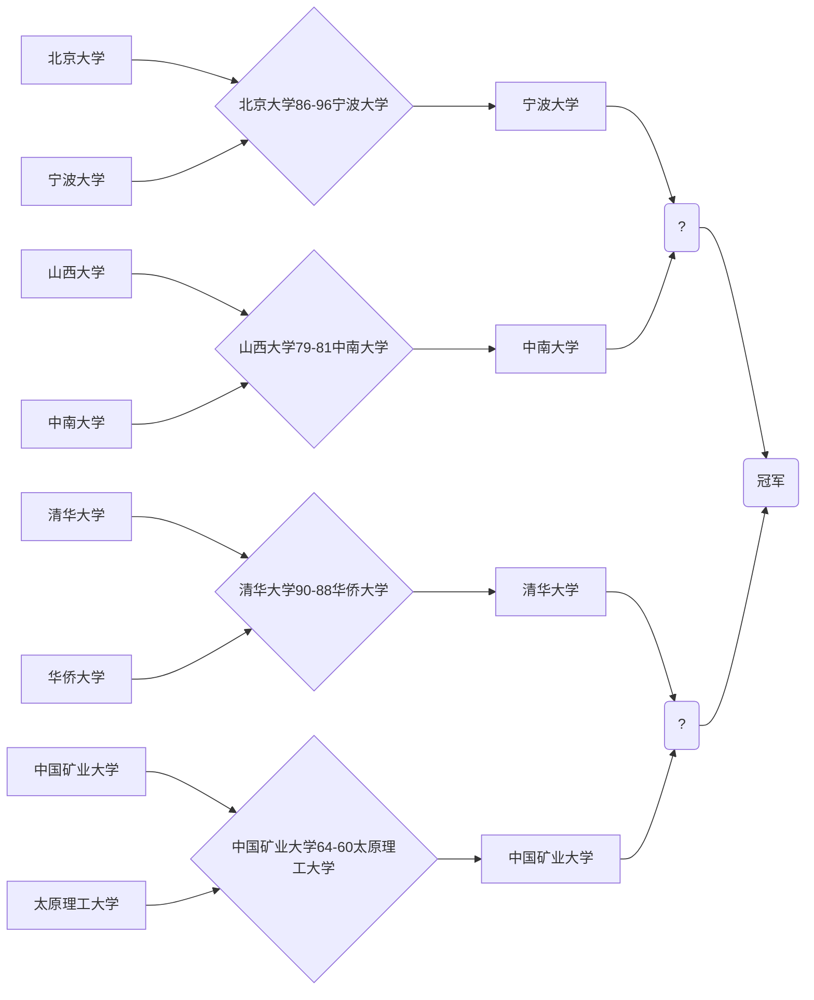

```mermaid
    graph LR;
    final(冠军)
    beijing[北京大学]
    ningbo[宁波大学]
    shanxi[山西大学]
    zhongnan[中南大学]
    qinghua[清华大学]
    huaqiao[华侨大学]
    kuangye[中国矿业大学]
    taiyuan[太原理工大学]

    top4_1[宁波大学]
    top4_2[中南大学]
    top4_3[清华大学]
    top4_4[中国矿业大学]

    result_1{北京大学86-96宁波大学}
    result_2{山西大学79-81中南大学}
    result_3{清华大学90-88华侨大学}
    result_4{中国矿业大学64-60太原理工大学}

    beijing-->result_1
    ningbo-->result_1
    result_1-->top4_1

    shanxi-->result_2
    zhongnan-->result_2
    result_2-->top4_2

    qinghua-->result_3
    huaqiao-->result_3
    result_3-->top4_3

    kuangye-->result_4
    taiyuan-->result_4
    result_4-->top4_4
    
    top2_1(?)
    top2_2(?)

    top4_1-->top2_1
    top4_2-->top2_1

    top4_3-->top2_2
    top4_4-->top2_2

    top2_1-->final
    top2_2-->final
```
